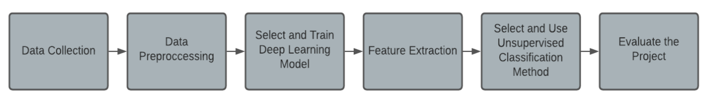

# Polar :snowflake:

Polar is an unsupervised anomaly detection system used to identify anomalous events found in videos generated by surveillance cameras. It mainly consists of a convolutional LSTM autoencoder and a machine learning classification model.

## :eyes: Overview

As a result of the increased usage of security cameras in many places, like airports, gardens, streets, squares, and even houses, the amount of data generated is huge and is growing daily. Finding useful meaning out of this data is problematic, as the number of meaningful events or occurrences in these videos is very small, and manually finding these anomalies requires human power and time that might not exist all the time. As a result, I propose in this report an automated solution that works to identify anomalous events found in videos generated by surveillance cameras, which aims to decrease the wasted human power used to track and identify them, and also provide additional support during the process.

Polar is designed to solve this problem, as it’s unsupervised, it depends on the ability of the models to identify and learn normal events from the training set, then when anomalous events occur, its job is to identify them.

  
## :school_satchel: Components

* Dataset
	* [University of California San Diego (UCSD) Anomaly Detection Dataset.](http://www.svcl.ucsd.edu/projects/anomaly/dataset.html)
	* Local CCTV camera videos.

* Data Processing
	* Convert local CCTV videos to TIFF frames.
	* Data augmentation to increase number of frames of UCSD dataset.

* Auto-encoder

    The auto-encoder is used to learn the underlying patterns in training frames. After that, it's used to regenerate the testing frames, and frames that differ from the ones it was trained on, they will be generated with low accuracy.

	Polar uses a convolutional LSTM auto-encoder, which is designed to remember information for long periods of time as well as forgetting a part of the stored data over time.

	The auto-encoder consists of:
	* Encoder: Spatial and Temporal
	* Convolutional LSTM Layer
	* Decoder: Temporal and Spatial

* One Class SVM

    It's an unsupervised machine learning model which is trained on one class of the data you have, and in the test its job is to classify the provided data into normal which is the same as the one it was trained on, or not normal which is anything else. In our case, the training set consisted of normal frames only, and the test set consisted of both normal and anomalous frames which we used the model to classify. The labels provided by the model are either one which indicates that the corresponding frame is normal, and negative one which indicates that frame consists an anomaly.